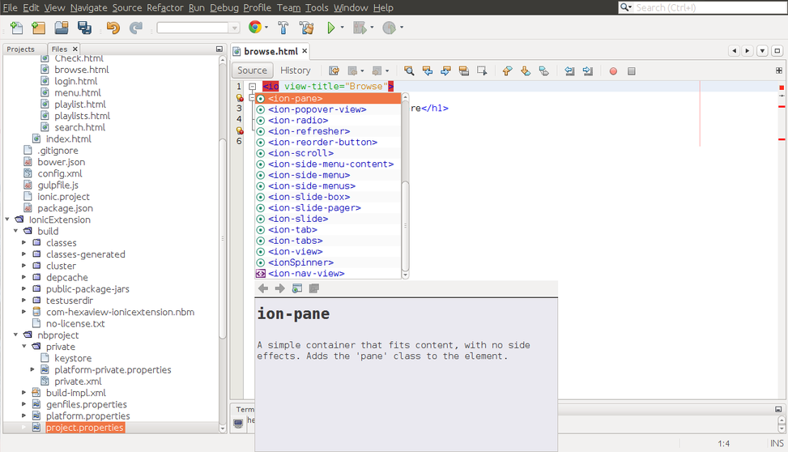

<h1>ionic-netbeans-plugin</h1>

A netbeans plugin for developing awesome hybrid mobile apps using <a href="http://ionicframework.com/" target="_blank"> Ionic Framework </a> which provide the auto-completion feature for Ionic tag elements with proper documentation. 

This plugin is helpful to integrate Ionic framework in netbeans. It shows details of the ionic tag directives which help to understand the usages of ioninc tags. 

</img>

This project uses GPL-LICENSE.

<h2>Installing the IonicExtension plugin for Netbeans</h2>

<ul>
<li>Download IonicExtension plugin from Netbeans plugins or click here <a href="http://plugins.netbeans.org/plugin/59028/?show=true" target="_blank">IonicExtention Plugin</a>  </li>
<li>Open Netbeans IDE and click Tools menu </li>
<li> Choose the plugins option</li>
<li>Plugins window pop-ups and select the Downloaded tab then click Add Plugin button</li>
<li>Browse to the downloaded IonicExtention file and then click OK button </li>
<li>Now click the Install button and simly accept the license and the certificate terms and click Finish</li>
</ul>

Congratulation , IonicExtention is added in Netbeans IDE   Enjoy!

